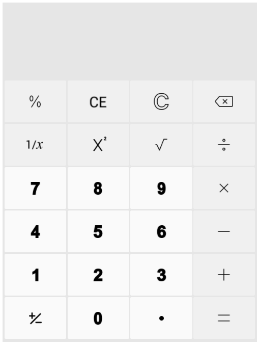

<h1 align="center">Calculator Web Application</h1>

    

## About

This is a calculator web application that allows users to perform basic mathematical operations such as addition, subtraction, multiplication, and division.

## Technologies Used

The Calculator web application is built using the following technologies:

- Spring Boot: A Java-based framework used for building web applications.
- Angular-CLI: A command-line interface tool used for creating and managing Angular projects.
- HTML: The standard markup language used for creating web pages.
- CSS: A style sheet language used for describing the presentation of a document written in HTML.
- TypeScript: A superset of JavaScript that adds optional static typing to the language.

## Features

The Calculator web application supports the following features, similar to the standard calculator on Windows:

- Addition
- Subtraction
- Multiplication
- Division

## Prerequisites

Before running the Calculator web application, make sure you have the following software installed:

- Java 11 or higher
- Node.js 12.14.x or higher
- Angular CLI 8.x or higher

## Installation

To install and run the Calculator web application, follow these steps:

1. Clone the repository: `git clone https://github.com/mo-ayman/Calculator.git`
2. Change to the project directory: `cd Calculator`
3. Install the necessary dependencies by running the following command: `npm install`
4. Start the application by running the following command: `ng serve --open`
5. Run the Spring Boot server by executing the main method of the CalculatorApplication class.

## License

This project is licensed under the MIT License - see the [LICENSE](https://github.com/mo-ayman/Calculator/blob/main/LICENSE.md) file for details.

## Acknowledgements

- [Spring Boot](https://spring.io/projects/spring-boot)
- [Angular CLI](https://angular.io/cli)
- [Stack Overflow](https://stackoverflow.com/)

